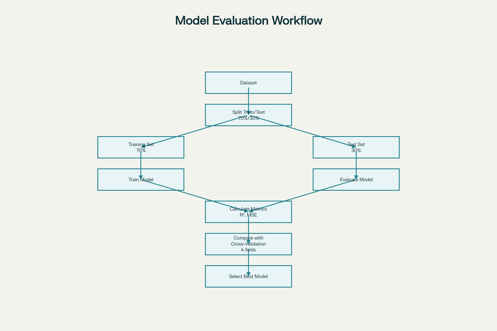
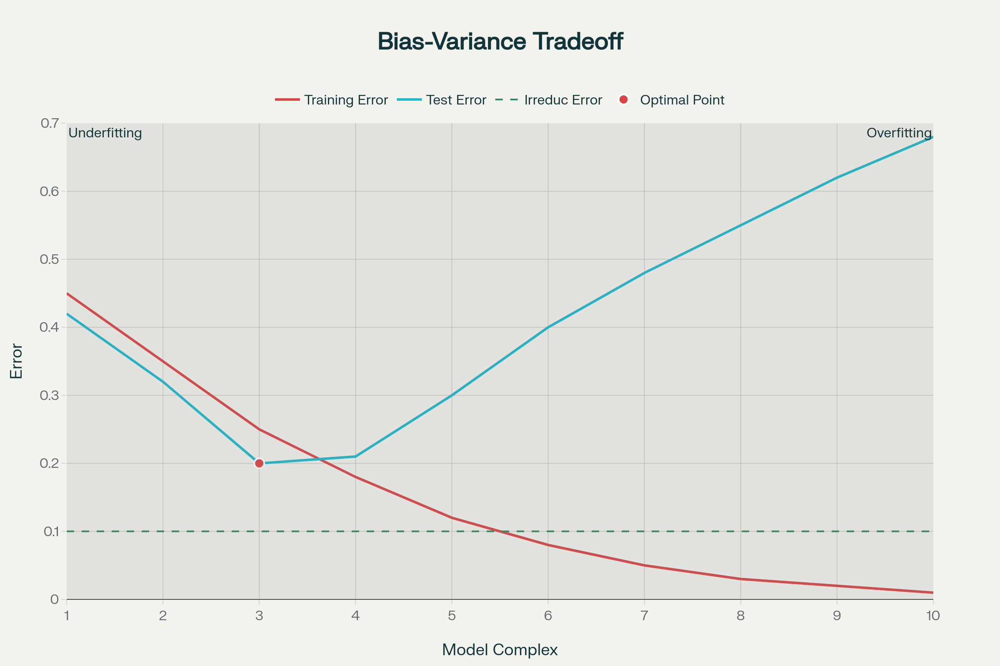
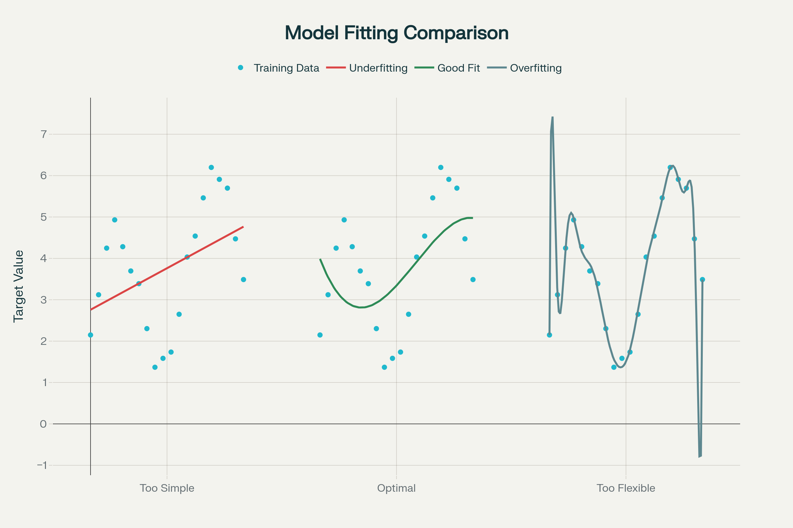
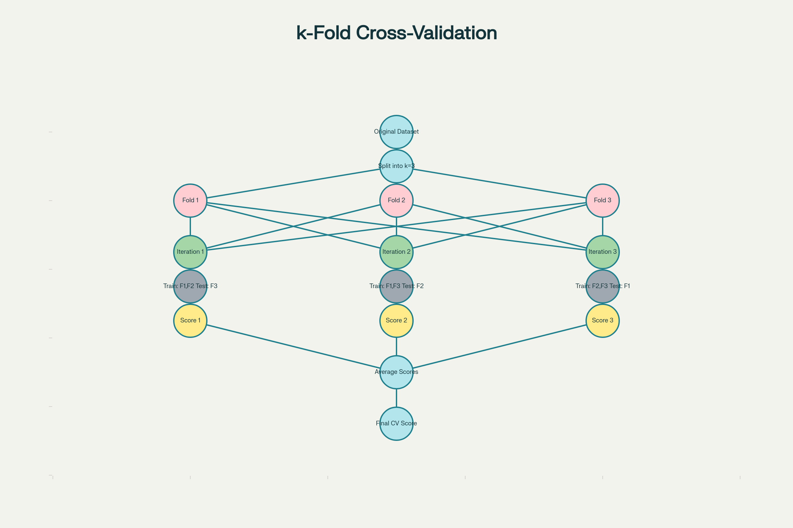

## Machine Learning Model Evaluation and Refinement: Summary

### Model Evaluation and Refinement

**Evaluation Purpose**: Model evaluation measures how well a trained model performs on **previously unseen data** in the real world, not just on training data.

**In-Sample vs Out-of-Sample Evaluation**: In-sample evaluation (training data) only tells us how well the model fits data it already saw. Out-of-sample evaluation (test data) provides a realistic estimate of real-world performance.

**Train-Test Split**: The standard approach splits data into two sets—typically 70% for training and 30% for testing. The training set builds the model, while the test set evaluates its generalization capability.

<p style="text-align:center">
    
</p>
Model Evaluation Workflow: Train-Test Split and Cross-Validation

**Key Concepts**:

The **generalization error** represents how well the model predicts unseen data. This is estimated using test set performance.

There's a trade-off between **accuracy and precision**. Using 90% training data gives accurate generalization estimates but poor precision (high variance across experiments). Using 30% training data gives precise estimates but lower accuracy (biased estimates).

**Cross-Validation**: To overcome train-test split limitations, cross-validation splits data into k equal folds. Each fold serves as a test set while others train the model. Results are averaged to provide stable out-of-sample error estimates.

**Implementation**: Scikit-learn provides two key functions:

- `cross_val_score()`: Returns averaged evaluation metrics (like R²)
- `cross_val_predict()`: Returns actual predictions before metric calculation, allowing deeper analysis

***

### Overfitting, Underfitting, and Model Selection

**Underfitting**: A model that is too simple fails to capture the underlying pattern in data. It performs poorly on both training and test sets.

**Overfitting**: A model that is too flexible memorizes noise in training data rather than learning the true function. It performs well on training data but poorly on test data.

**Model Selection Goal**: Find the optimal model complexity that minimizes **test error** (not training error). Training error continuously decreases with complexity, but test error has a U-shape with an optimal point.

<p style="text-align:center">
    
</p>

Bias-Variance Tradeoff: Training vs Test Error Across Model Complexity

**Selection Process**: Compare models of different complexity levels using test set metrics (R², MSE). Select the order/complexity that minimizes test error. Everything left of this point is underfitting; everything right is overfitting.

**Irreducible Error**: Even the perfect model has baseline error from:

- Random noise in the data (cannot be predicted)
- Wrong model assumptions (e.g., fitting a polynomial to sine wave data)
- Insufficient or incorrect features

**Polynomial Order Selection Example**: For real data (horsepower vs price), polynomial order 3 was optimal with R²=0.9. Order 4 showed R²=0.6, indicating overfitting.

<p style="text-align:center">
    
</p>

Underfitting vs Good Fit vs Overfitting: Visual Comparison

***

### Key Python Implementation Pattern

```python
r_squared_list = []
polynomial_orders = [1, 2, 3, 4, 5]

for order in polynomial_orders:
    # Create and transform polynomial features
    poly_features = PolynomialFeatures(degree=order)
    x_train_poly = poly_features.fit_transform(x_train)
    x_test_poly = poly_features.transform(x_test)
    
    # Fit model and calculate R²
    model = LinearRegression()
    model.fit(x_train_poly, y_train)
    r2 = model.score(x_test_poly, y_test)
    r_squared_list.append(r2)

# Select order with highest R² on test set
```


***

## Diagrams

**Model Evaluation Workflow**:

**Bias-Variance Tradeoff Visualization**:

**Three Fitting States Comparison**:

**K-Fold Cross-Validation Process**:

<p style="text-align:center">
    
</p>
K-Fold Cross-Validation Process (k=3)


### **Model Evaluation and Refinement – Summary**

* **Train-Test Split**

  * Use `train_test_split()` to divide data into:

    * **Training set** → train model & find predictive patterns
    * **Test set** → evaluate model performance on unseen data

* **Generalization Error**

  * Measures how well a model predicts **new/unseen data**.
  * Low generalization error = good model performance.

* **Cross-Validation**

  * Split data into **k folds**.
  * Train on (k–1) folds and test on the remaining one.
  * Repeat for all folds and average results to estimate **out-of-sample error**.

* **Model Complexity**

  * **Underfitting** → Model too simple (high bias).
  * **Overfitting** → Model too complex (high variance).
  * Choose polynomial order that **minimizes test error** (plot MSE vs polynomial order).

* **Ridge Regression**

  * Used when predictors are **highly correlated**.
  * Prevents **overfitting** by penalizing large coefficients.
  * Controlled by **hyperparameter α (alpha)**.

* **Selecting Best α (Regularization Strength)**

  * Split data into **training and validation sets**.
  * Train model for different α values → compute **R²** on validation set.
  * Choose α that **maximizes R²** (best generalization).

* **Grid Search**

  * Automates hyperparameter tuning using **cross-validation**.
  * `GridSearchCV()` tests combinations of parameters and selects the best.
  * Input: dictionary → `{ 'alpha': [0.01, 0.1, 1, 10] }`.

---

### **Diagram (Concept Flow)**

```
        +----------------+
        |  Raw Dataset   |
        +-------+--------+
                |
      ---------------------
      |                   |
+-----------+       +-------------+
| Train Set |       |  Test Set   |
+-----------+       +-------------+
      |                     |
  Model Training      Model Evaluation
      |                     |
      |       Cross-Validation (K-Folds)
      |_____________________|
               ↓
     Evaluate Generalization Error
               ↓
   Optimize Polynomial Order / α
               ↓
        Grid Search → Best Model
```


