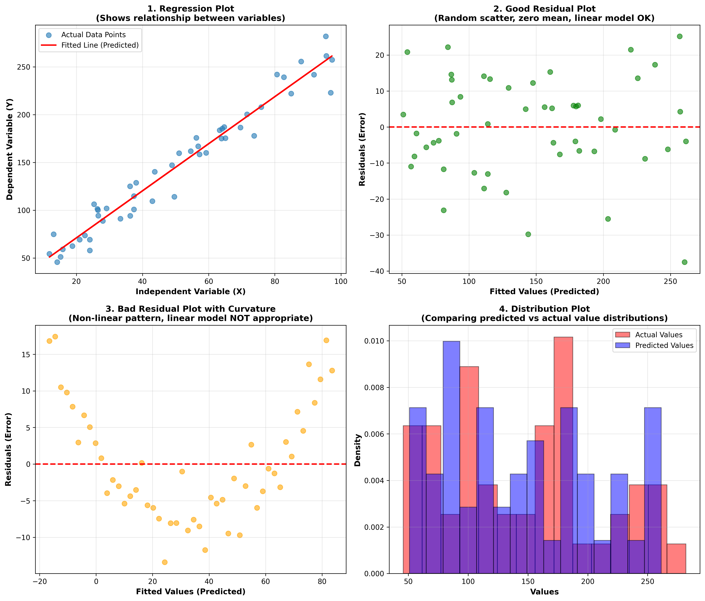

## Model Evaluation using Visualization

Model evaluation using visualization is a critical technique for assessing regression model performance and diagnosing potential issues. The three primary visualization methods are regression plots, residual plots, and distribution plots.[^1]

### Three Key Visualization Types

**Regression Plot**

A regression plot displays the relationship between independent and dependent variables, showing both the actual data points and the fitted prediction line. The horizontal axis represents the independent variable (feature), while the vertical axis shows the dependent variable (target). Each scatter point represents an actual observation, and the fitted line shows predicted values from the model.[^1]

Using Seaborn, you can create a regression plot with `sns.regplot()`, specifying the x parameter for the independent variable column, y parameter for the dependent variable column, and data parameter for the dataframe. This visualization helps assess the strength and direction (positive or negative) of the correlation between variables.[^1]

**Residual Plot**

The residual plot is essential for evaluating model appropriateness by visualizing the error between predicted and actual values. The residual is calculated by subtracting the predicted value from the actual target value, then plotting these errors on the vertical axis against the dependent variable on the horizontal axis.[^1]

A **good residual plot** indicates a linear model is appropriate when residuals:[^1]

- Have zero mean
- Are distributed evenly around the x-axis
- Show similar variance across all x values
- Display no curvature pattern

A **bad residual plot** reveals model inadequacy through several patterns:[^1]

- **Curvature**: When residuals show a curved pattern with errors changing systematically with x (positive in some regions, negative in others), this suggests the linear assumption is incorrect and a non-linear function is needed[^1]
- **Increasing variance**: When residual variance increases with x values, the model is incorrect and exhibits heteroscedasticity[^1]
- **Non-random separation**: When residuals aren't randomly distributed, this indicates systematic errors in the model[^1]

You can create residual plots using Seaborn's `sns.residplot()` function, with the first parameter being the feature series and the second being the target series.[^1]

**Distribution Plot**

Distribution plots compare predicted values against actual values by counting and plotting their frequency distributions. These visualizations are particularly valuable for models with multiple independent variables or features.[^1]

The process converts continuous target and predicted values into distributions where the vertical axis is scaled to make the area under each distribution equal to one. Typically, predicted values appear in blue and actual values in red.[^1]

This plot helps identify specific value ranges where model performance varies. For example, you might discover that predictions in the 40,000-50,000 range are inaccurate, while predictions in the 10,000-20,000 range closely match target values. When using multiple features, the predicted values generally become much closer to target values.[^1]

To create a distribution plot, use actual values as the first parameter with `hist=False` to generate a distribution rather than histogram, specify color as red, and include appropriate labels. Then add the predicted values for the second plot with corresponding parameters.[^1]

### Visual Examples

The visualization above demonstrates all three evaluation techniques with practical examples:

1. **Top-left**: Regression plot showing the relationship between variables with actual data points (scatter) and the fitted prediction line
2. **Top-right**: Good residual plot with random scatter around zero, indicating the linear model is appropriate
3. **Bottom-left**: Bad residual plot exhibiting curvature, signaling that a non-linear model should be used instead
4. **Bottom-right**: Distribution plot comparing predicted (blue) versus actual (red) value distributions to assess overall model fit

These visualization techniques provide complementary insights into model performance, helping you identify when models are appropriate, detect systematic errors, and understand which value ranges have better or worse predictions.

    

