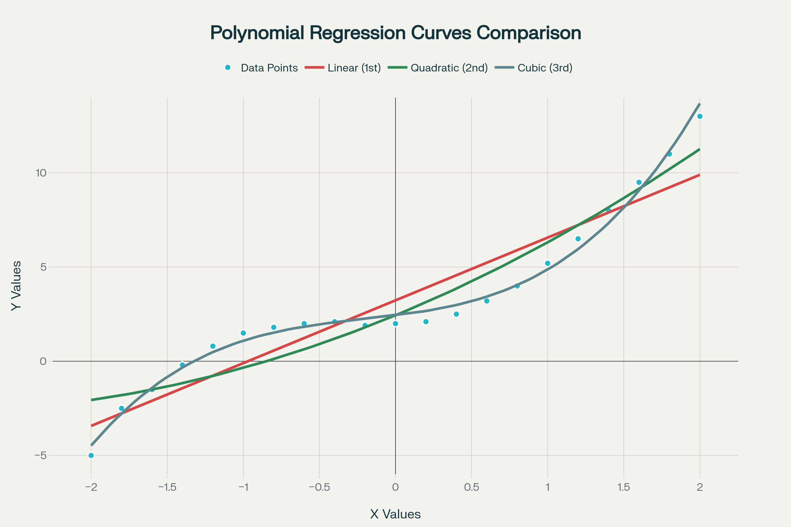
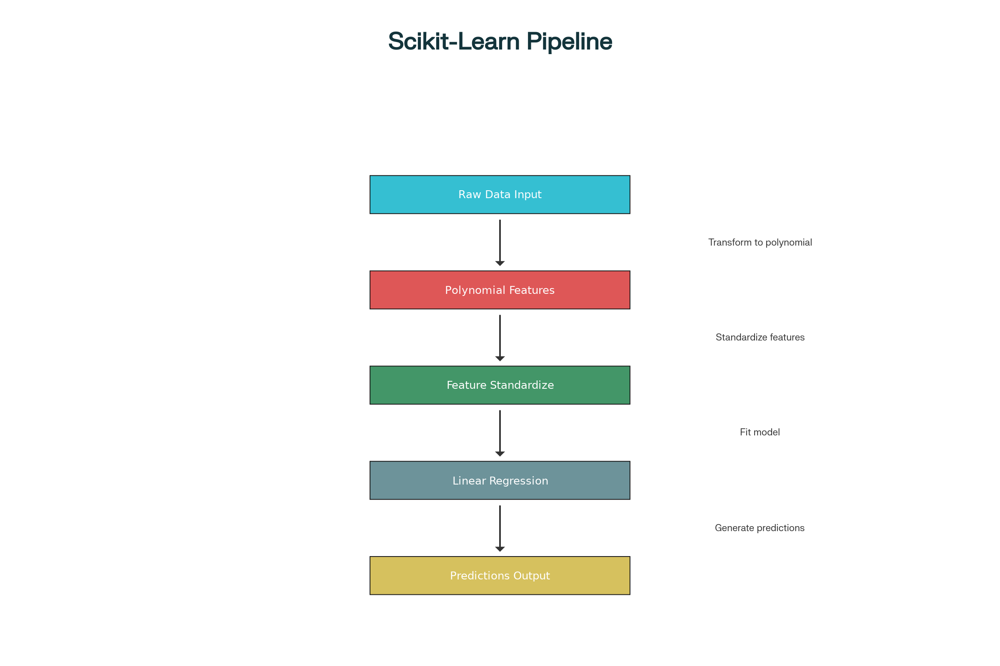

## Polynomial Regression and Pipelines: Comprehensive Summary

### **Polynomial Regression**

**What It Is:** Polynomial regression is an extension of linear regression used when data exhibits **curvilinear (non-linear) relationships**. While it appears to be non-linear on the surface, it's actually a special case of linear regression where the relationship between features and parameters remains linear—only the features are transformed into polynomial terms.[^1]

**Key Concept:** Instead of fitting a simple straight line, polynomial regression fits a curved line by creating higher-order polynomial terms from the predictor variables. The data is transformed first, then standard linear regression is applied.

**Polynomial Degrees:**[^1]

- **1st Order (Linear):** Standard linear regression with a straight line fit
- **2nd Order (Quadratic):** Includes $x^2$ terms, creating a parabolic curve
- **3rd Order (Cubic):** Includes $x^3$ terms, allowing for more complex patterns with inflection points

The **degree of the polynomial** critically determines the quality of fit. Higher degrees provide more flexibility but increase the risk of overfitting.

**Visual Representation:**

<p style="text-align:center">
    
</p>

Polynomial Regression: Comparison of Linear, Quadratic, and Cubic Fits to Sample Data

This chart demonstrates how different polynomial degrees fit the same data differently, with each higher degree capturing more complex patterns in the data.

**Implementation Approaches:**[^1]

- **NumPy `polyfit` function:** Simple for 1D polynomial regression, outputs coefficients of the polynomial
- **Scikit-learn `PolynomialFeatures`:** Required for multidimensional data, transforms features and supports higher dimensions

**Example (3rd Order Polynomial):**[^1]
The fitted model equation: $-1.557x_1^3 + 204.8x_1^2 + 8965x_1 + 1.37 \times 10^5$

***

### **Pipelines**

**What It Is:** Pipelines are a scikit-learn utility that **simplifies machine learning workflows** by chaining multiple preprocessing and modeling steps into a single object. They sequentially apply transformations, with the final step producing predictions.[^1]

**Why Use Pipelines?**[^1]

Pipelines streamline code and prevent data leakage by properly handling the separation between training and prediction phases. Instead of manually applying each transformation separately, a pipeline automates the entire process.

**Pipeline Workflow:**[^1]

<p style="text-align:center">
    
</p>

Scikit-Learn Pipeline Workflow: Sequential Transformations and Predictions

**Pipeline Structure:**[^1]

A pipeline is created as a list of tuples, where each tuple contains:

- **First element:** Name of the estimator/transformation (string identifier)
- **Second element:** The model constructor or transformer object

**Common Pipeline Steps:**[^1]

- Polynomial feature transformation
- Feature normalization/standardization
- Linear regression or other models

***

### **Practical Implementation**

**Code Example - Building a Complete Pipeline:**

```python
from sklearn.pipeline import Pipeline
from sklearn.preprocessing import PolynomialFeatures, StandardScaler
from sklearn.linear_model import LinearRegression

# Create pipeline with sequential steps
pipeline = Pipeline([
    ('poly_features', PolynomialFeatures(degree=2)),
    ('normalization', StandardScaler()),
    ('linear_regression', LinearRegression())
])

# Train the pipeline
pipeline.fit(X_train, y_train)

# Make predictions (all transformations applied automatically)
y_pred = pipeline.predict(X_test)
```

**Feature Normalization Step:** When dealing with features at different scales (e.g., one ranging 1-3 and another 1000-3000), the `StandardScaler` standardizes each feature simultaneously to have mean 0 and standard deviation 1.[^1]

**Multidimensional Polynomial Example:** For 2D data with 2nd order polynomials, the `PolynomialFeatures` transformer creates features including: $1, x_1, x_2, x_1^2, x_1 \times x_2, x_2^2$. NumPy's `polyfit` cannot handle this complexity, making scikit-learn essential for multidimensional cases.[^1]

***

### **Key Takeaways**

**Polynomial Regression:**

- Handles non-linear data patterns through feature transformation
- Maintains linear parameter relationships despite appearing non-linear
- Degree selection is critical—higher degrees risk overfitting

**Pipelines:**

- Eliminate repetitive transformation code
- Prevent data leakage automatically
- Enable seamless cross-validation and model deployment
- Make workflows more maintainable and readable

<div align="center">⁂</div>

[^1]: subtitle_Polynomial-Regression-and-Pipelines.txt

