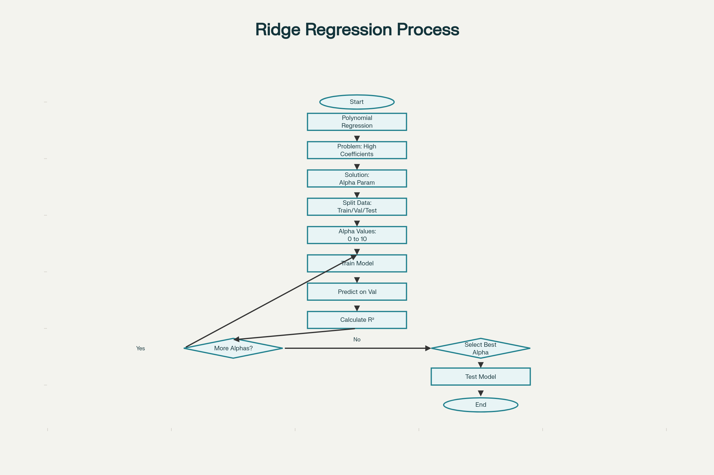
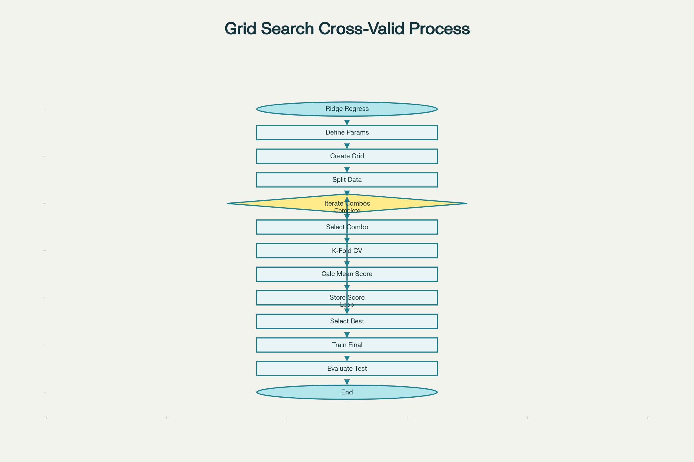

## Ridge Regression and Grid Search: Comprehensive Summary

### Ridge Regression

**Purpose and Problem Solved**

Ridge Regression is a regularization technique designed to **prevent overfitting** in regression models, particularly when working with polynomial regression or multiple independent variables. The primary issue it addresses is when high-order polynomial coefficients become excessively large in magnitude, causing the model to fit noise and outliers rather than the underlying pattern.

**How Ridge Regression Works**

Ridge Regression introduces a **hyperparameter called Alpha (α)** that controls the magnitude of polynomial coefficients. The key mechanism is:

- As Alpha increases, coefficient magnitudes decrease (especially for higher-order terms)
- Alpha must be carefully selected to balance between overfitting and underfitting
- Alpha is set **before** fitting or training the model

**Effect of Different Alpha Values**


| Alpha Value | Coefficient Behavior | Model Performance |
| :-- | :-- | :-- |
| **α = 0** | Very large magnitudes (up to 880+) | Severe overfitting - model fits noise and outliers |
| **α = 0.001** | Moderate reduction | Overfitting begins to subside |
| **α = 0.01** | Significant reduction | Good fit - estimated function tracks actual function well |
| **α = 0.1 to 1** | Further reduction | Optimal balance, but signs of underfitting start at α = 1 |
| **α = 10** | Coefficients approach zero | Severe underfitting - insufficient flexibility, doesn't track data |

**Selecting the Optimal Alpha**

The selection process uses **cross-validation** with a validation dataset:

1. Split data into **training, validation, and test sets**
2. Start with a small Alpha value
3. Train the model and make predictions on validation data
4. Calculate R² score (or MSE) and store results
5. Repeat for progressively larger Alpha values
6. **Select the Alpha that maximizes R²** on validation data
7. Test final model performance on test data

<p>
    
</p>

Ridge Regression workflow showing how Alpha parameter is selected using cross-validation

**Implementation in Python**

```python
from sklearn.linear_models import Ridge

# Create Ridge regression object with Alpha parameter
ridge_model = Ridge(alpha=0.01)

# Train the model
ridge_model.fit(X_train, y_train)

# Make predictions
predictions = ridge_model.predict(X_validation)
```

The validation plot typically shows R² increasing and converging as Alpha increases (around 0.75 for the example with used car data), while test data R² may decrease slightly due to regularization preventing overfitting.

***

### Grid Search Cross-Validation

**Purpose and Functionality**

Grid Search is an **automated hyperparameter tuning method** that systematically scans through multiple hyperparameter combinations using cross-validation. It eliminates the manual trial-and-error process of finding optimal hyperparameters.

**Key Concepts**

- **Hyperparameters** are parameters not learned during training (e.g., Alpha in Ridge Regression, normalization options)
- Grid Search calculates **mean squared error (MSE) or R²** for various hyperparameter combinations
- Automatically selects the combination that produces the best performance

**The Grid Search Process**

1. **Define parameter grid** as a Python dictionary:
    - Keys = hyperparameter names (e.g., 'alpha', 'normalize')
    - Values = list of values to test for each parameter
2. **Data splitting**: Divide dataset into training, validation, and test sets
3. **Systematic evaluation**:
    - Train models with each hyperparameter combination
    - Use k-fold cross-validation for each combination
    - Calculate performance metrics (R² or MSE)
4. **Select best parameters**: Choose the combination that minimizes MSE or maximizes R²
5. **Final testing**: Evaluate final model on test data


<p>
    
</p>

Grid Search Cross-Validation workflow for systematic hyperparameter tuning

**Implementation Example**

```python
from sklearn.model_selection import GridSearchCV
from sklearn.linear_models import Ridge

# Define parameter grid
parameters = {
    'alpha': [0.001, 0.01, 0.1, 1, 10, 100],
    'normalize': [True, False]
}

# Create Ridge model
ridge = Ridge()

# Create GridSearchCV object
grid_search = GridSearchCV(
    estimator=ridge,
    param_grid=parameters,
    scoring='r2',  # Default scoring method
    cv=4  # Number of folds
)

# Fit the grid search
grid_search.fit(X_train, y_train)

# Get best parameters
best_params = grid_search.best_estimator_

# Access results
cv_results = grid_search.cv_results_
```

**Advantages of Grid Search**

- **Speed and efficiency**: Tests multiple parameters with minimal code
- **Comprehensive exploration**: Evaluates all combinations in the parameter grid
- **Reproducibility**: Systematic approach ensures consistent results
- **Multiple parameter support**: Can tune several hyperparameters simultaneously (e.g., both alpha and normalization)

**Grid Structure Example**

For Ridge Regression with two parameters:

- **Alpha values**: [0.001, 0.01, 0.1, 1, 10]
- **Normalize options**: [True, False]

This creates a grid with **10 total combinations** (5 alpha values × 2 normalize options), and Grid Search evaluates each combination using cross-validation.

**Output and Results**

Grid Search provides:

- **Scores for all parameter combinations** stored in `cv_results_` dictionary
- **Best estimator** with optimal hyperparameter values via `best_estimator_` attribute
- **Mean scores on validation data** for analysis and comparison

***

### Relationship Between Ridge Regression and Grid Search

Grid Search is commonly used to find the optimal Alpha value for Ridge Regression, automating the manual validation process described earlier. Instead of manually testing different Alpha values, Grid Search systematically evaluates all specified values and selects the one that maximizes model performance on validation data.


