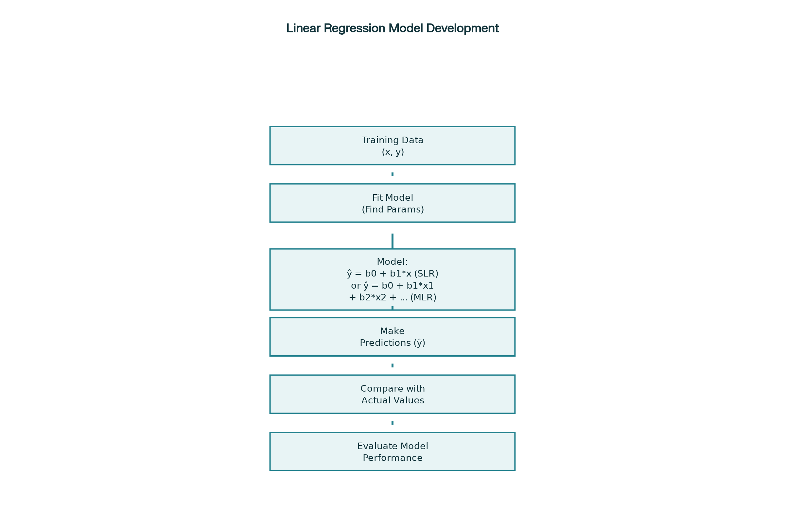
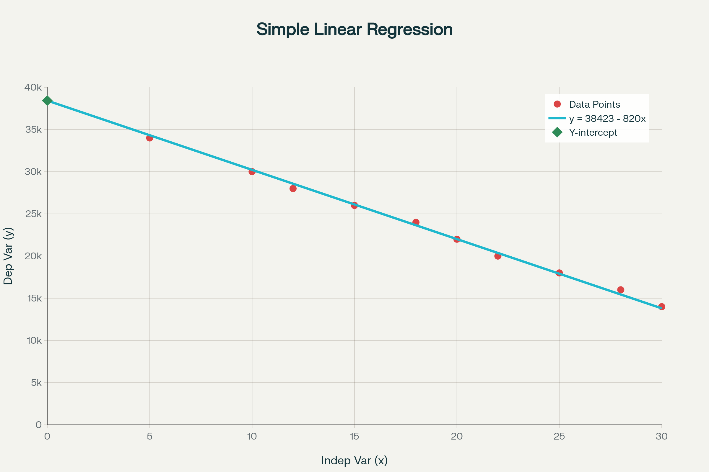
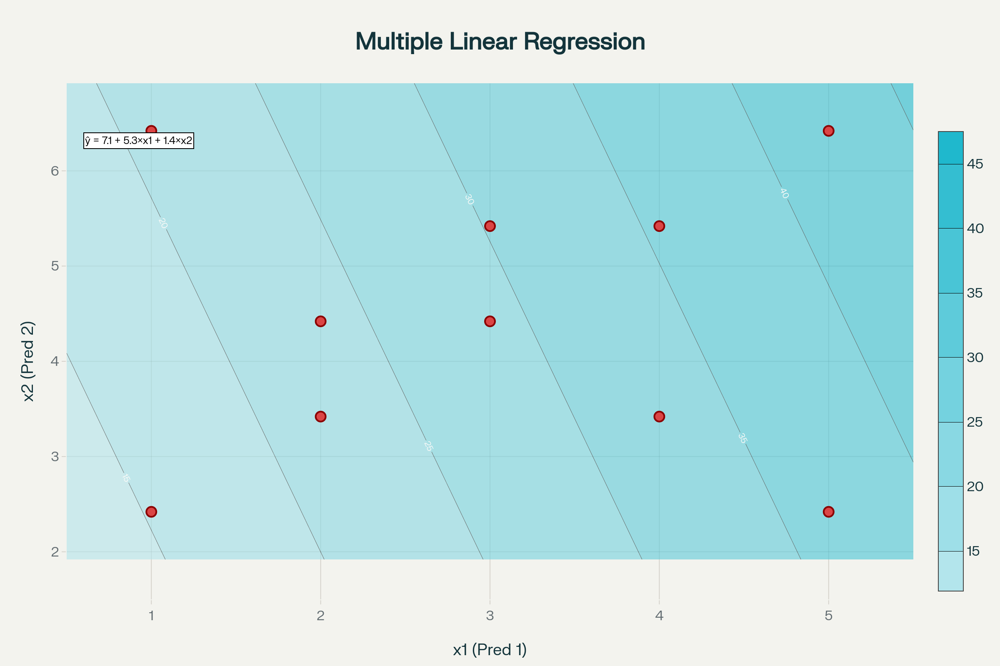
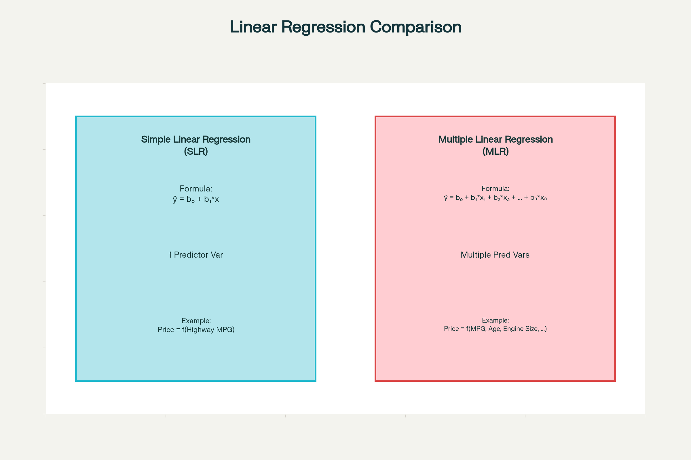

# Model Development: Linear Regression Summary

## What is a Model?

A **model** or **estimator** is a mathematical equation used to predict a value given one or more other values. It establishes relationships between:
- **Independent variables** (features/predictors)
- **Dependent variables** (target/output)

**Key principle**: More relevant data typically leads to more accurate models.

### Example
- **Input**: Car's highway miles per gallon (independent variable)
- **Output**: Car's price (dependent variable)

## Simple Linear Regression (SLR)

**Simple Linear Regression** is a method to understand the relationship between **two variables**: one predictor (independent variable x) and one target (dependent variable y).

<p style="text-align:center">
    
</p>

### Mathematical Formula

The linear relationship is expressed as:

**ŷ = b₀ + b₁ × x**

Where:
- **ŷ** (y-hat) = Predicted value
- **b₀** = Intercept (value when x = 0)
- **b₁** = Slope (rate of change)
- **x** = Independent variable

**Price = 38,423.31 - 821.73 × Highway_MPG**

This equation means:
- Base price (intercept): $38,423.31
- For every 1 MPG increase, price decreases by $821.73

### Key Concepts

1. **Training Process**: Use training data points to determine parameters b₀ and b₁
2. **Noise**: Random small values account for uncertainty in real-world data
3. **Prediction**: Model estimates may not match actual values exactly
4. **Data Storage**: 
   - Predictor variables stored in dataframe/array **X**
   - Target variable stored in array **y**

### Python Implementation (scikit-learn)

```python
# Import library
from sklearn.linear_model import LinearRegression

# Create linear regression object
lm = LinearRegression()

# Define predictor and target variables
X = # predictor variable(s)
y = # target variable

# Fit the model (find parameters)
lm.fit(X, y)

# Make predictions
y_pred = lm.predict(X_new)

# Access model parameters
intercept = lm.intercept_  # b₀
slope = lm.coef_          # b₁
```
<p style="text-align:center">
    
</p>

## Multiple Linear Regression (MLR)

**Multiple Linear Regression** explains the relationship between **one continuous target variable** and **two or more predictor variables**.

<p style="text-align:center">
    
</p>

### Mathematical Formula

**ŷ = b₀ + b₁×x₁ + b₂×x₂ + b₃×x₃ + ... + bₙ×xₙ**

Where:
- **ŷ** = Predicted value
- **b₀** = Intercept
- **b₁, b₂, ..., bₙ** = Coefficients for each predictor variable
- **x₁, x₂, ..., xₙ** = Independent variables

### Visualization

- **2 variables**: Can be visualized on a 2D plane with height representing predicted values
- **More variables**: Extends to higher dimensions (harder to visualize)

### Python Implementation

```python
# Extract multiple predictor variables
Z = # dataframe with multiple columns (features)

# Train the model
lm.fit(Z, y)

# Make predictions
# Input: Array/dataframe with same number of columns as training
predictions = lm.predict(Z_new)

# Access parameters
intercept = lm.intercept_      # b₀
coefficients = lm.coef_        # [b₁, b₂, b₃, ...]
```

## Comparison: SLR vs MLR

[6]

| Aspect | Simple Linear Regression | Multiple Linear Regression |
|--------|-------------------------|---------------------------|
| **Predictors** | 1 independent variable | 2+ independent variables |
| **Formula** | ŷ = b₀ + b₁×x | ŷ = b₀ + b₁×x₁ + b₂×x₂ + ... |
| **Visualization** | 2D line | 3D plane (2 vars) or higher dimensions |
| **Example** | Price = f(Highway MPG) | Price = f(MPG, Age, Engine Size, ...) |
| **Accuracy** | Limited by single feature | Generally more accurate with relevant features |

<p style="text-align:center">
    
</p>


## Model Development Process

The linear regression model development follows these steps:

1. **Collect Training Data**: Gather data points with known input-output pairs
2. **Fit the Model**: Use training data to find optimal parameters (b₀, b₁, etc.)
3. **Create Model**: Establish the mathematical relationship
4. **Make Predictions**: Use model to predict new, unseen values
5. **Evaluate Performance**: Compare predictions with actual values
6. **Refine**: Adjust model based on performance

## Important Considerations

### Why More Features Help

**Example**: Two identical cars, one pink and one red
- Pink cars sell for significantly less
- If your model doesn't include color as a feature, it will predict the same price for both cars
- This leads to inaccurate predictions

### Model Limitations

1. **Noise**: Random variations in real-world data
2. **Linear Assumption**: May not hold for all relationships  
3. **Missing Features**: Important variables not included in the model
4. **Prediction Accuracy**: Models provide estimates, not exact values

## Key Takeaways

1. **Start Simple**: Begin with simple linear regression to understand basic relationships
2. **Add Complexity**: Use multiple linear regression when multiple factors influence the outcome
3. **Feature Selection**: Include relevant predictor variables for better accuracy
4. **Validation**: Always compare predictions with actual values
5. **Iteration**: Continuously improve models with more data and better features

## Applications

Linear regression is widely used for:
- **Price Prediction**: Cars, houses, products
- **Sales Forecasting**: Based on marketing spend, seasonality
- **Risk Assessment**: Insurance, finance
- **Performance Analysis**: Sports, business metrics
- **Scientific Research**: Understanding variable relationships

---

*This summary covers the fundamental concepts of linear regression for model development, providing both theoretical understanding and practical implementation guidance.*